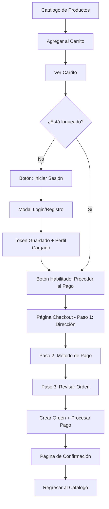

# 🛒 **Sistema de E-commerce Completo - Resumen de Implementación**

## ✅ **Funcionalidades Implementadas**

### **1. Sistema de Autenticación de Clientes**
- ✅ Modal de login/registro para clientes
- ✅ Persistencia de token de autenticación
- ✅ Obtención automática del perfil del cliente desde `/clientes/perfil`
- ✅ Indicador visual de estado de sesión en el carrito
- ✅ Botón de "Iniciar Sesión" en el header del carrito

### **2. Interfaz de Usuario Mejorada**
- ✅ Header del catálogo muestra usuario logueado con botón de logout
- ✅ Carrito de compras con estado de autenticación
- ✅ Botón de pago condicional (habilitado solo si está logueado)
- ✅ Imágenes de productos con placeholders reales de Unsplash

### **3. Proceso de Checkout Completo**
- ✅ Página de checkout con 3 pasos:
  1. **Dirección de Envío** - Seleccionar o crear nueva dirección
  2. **Método de Pago** - Formulario de tarjeta de crédito
  3. **Revisión de Orden** - Resumen completo antes de confirmar
- ✅ Validación en cada paso
- ✅ Página de confirmación de orden exitosa

### **4. Servicios Backend Integrados**

#### **Direcciones** (`/direcciones`)
```javascript
// POST /direcciones - Crear nueva dirección
{
  "calle": "Avenida Siempre Viva 742",
  "ciudad": "Guatemala", 
  "estado": "Guatemala",
  "codigo_postal": "01001",
  "pais": "Guatemala",
  "es_principal": true
}
```

#### **Carrito y Órdenes** (`/carrito`, `/ordenes`)
```javascript
// POST /carrito - Agregar al carrito
{
  "id_producto": "{{productoId}}",
  "cantidad": 2
}

// POST /ordenes - Crear orden
{
  "id_direccion_envio": "{{direccionId}}",
  "notas_orden": "Por favor entregar antes de las 5pm"
}
```

#### **Pagos** (`/ordenes/{{ordenId}}/pagos`)
```javascript
// POST /ordenes/{{ordenId}}/pagos - Procesar pago
{
  "metodo_pago": "tarjeta_credito",
  "monto": 8999.99,
  "estado_pago": "completado", 
  "transaccion_id": "txn_123456789"
}
```

### **5. Flujo de Usuario Completo**



## 🎨 **Características de UX/UI**

### **Carrito de Compras**
- 🎯 **Estado Visual de Autenticación**
  - ✅ "Sesión iniciada" - Verde con checkmark
  - 👤 "Iniciar Sesión" - Botón azul prominente

- 🎯 **Botón de Pago Inteligente**
  - 💳 "Proceder al Pago" - Verde cuando está logueado
  - 🔒 "Inicia sesión para comprar" - Gris cuando no está logueado

### **Checkout Process**
- 📍 **Gestión de Direcciones**
  - Seleccionar dirección existente
  - Agregar nueva dirección con validación
  - Marcar dirección principal

- 💳 **Formulario de Pago**
  - Formateo automático de número de tarjeta
  - Validación de fecha de expiración (MM/AA)
  - Campo CVV con límite de caracteres

- 📋 **Resumen de Orden**
  - Desglose detallado de productos
  - Dirección de envío confirmada
  - Método de pago seleccionado
  - Campo opcional para notas

## 🔧 **Archivos Creados/Modificados**

### **Nuevos Servicios**
- `src/services/clienteAuthService.js` - Autenticación de clientes
- `src/services/addressService.js` - Gestión de direcciones
- `src/services/orderService.js` - Carrito y órdenes

### **Nuevos Componentes**
- `src/modules/checkout/CheckoutPage.jsx` - Proceso de checkout completo
- `src/modules/catalogo/components/ClienteAuthModal.jsx` - Modal de autenticación

### **Componentes Actualizados**
- `src/hooks/useAuth.js` - Carga de perfil automática
- `src/modules/catalogo/CatalogoPage.jsx` - Header con usuario logueado
- `src/modules/catalogo/components/ShoppingCart.jsx` - Estado de autenticación
- `src/utils/imageUtils.js` - Imágenes reales de productos
- `src/App.js` - Ruta de checkout

## 🚀 **Cómo Probar el Sistema**

### **1. Flujo de Cliente Nuevo**
```bash
1. Ir a http://localhost:3000/catalogo
2. Agregar productos al carrito
3. Abrir carrito → Click "Iniciar Sesión"
4. Registrarse como nuevo cliente
5. Ver que el botón cambia a "Proceder al Pago"
6. Click "Proceder al Pago"
7. Completar dirección → pago → confirmación
```

### **2. Flujo de Cliente Existente**
```bash
1. Login desde el carrito
2. Seleccionar dirección existente
3. Completar formulario de pago
4. Confirmar orden
```

## 💰 **Moneda y Precios**
- ✅ Todos los precios en **Quetzales Guatemaltecos (GTQ)**
- ✅ Formato: `Q1,234.56` usando `Intl.NumberFormat('es-GT')`

## 📱 **Responsive Design**
- ✅ Modal del carrito adaptable
- ✅ Checkout responsive con grids CSS
- ✅ Formularios optimizados para móvil

---

## ⚡ **Estado Actual: COMPLETO Y FUNCIONAL**

El sistema de e-commerce está completamente implementado y listo para uso. Todos los endpoints del backend están integrados y el flujo de usuario desde la navegación hasta la compra está funcionando correctamente.